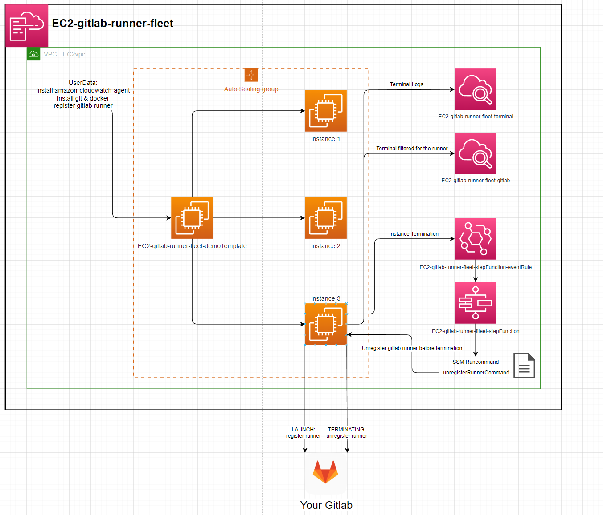

# EC2-gitlab-runner-fleet

---

# Instance:
ImageId: ami-084e8c05825742534 (eu-west-2)
InstanceType: t2.micro

# Runners:
executor: docker
image: gitlab-runner:latest
privileged: true (docker-in-docker)

---

# Setup:
1. Get Gitlab runner token:
   - create a group in your gitlab
   - acquire a token for that group: https://gitlab.com/groups/YOUR_GROUP/-/runners

2. Download the template.
3. Go to AWS Cloudformation, create stack, upload template.
4. enter a stack name, your token & a scalingGroupDesiredSize (1 will work).

5. finish creating the stack.
6. the ec2 instances & runners will be created.
7. Cloudwatch logs /aws/ec2/STACK_NAME-terminal & /aws/ec2/STACK_NAME-gitlab will show the instances internal logs
8. after less than 5 mins the runners will be visible in https://gitlab.com/groups/YOUR_GROUP/-/runners names after the instance they're running on.

Terminating an instance will result in the runner being unregistered before the instance is terminated
